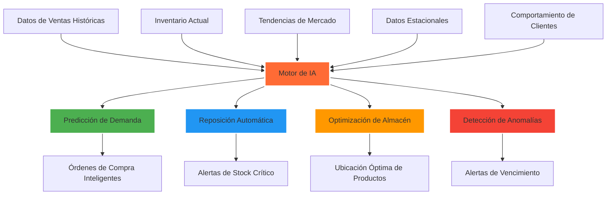
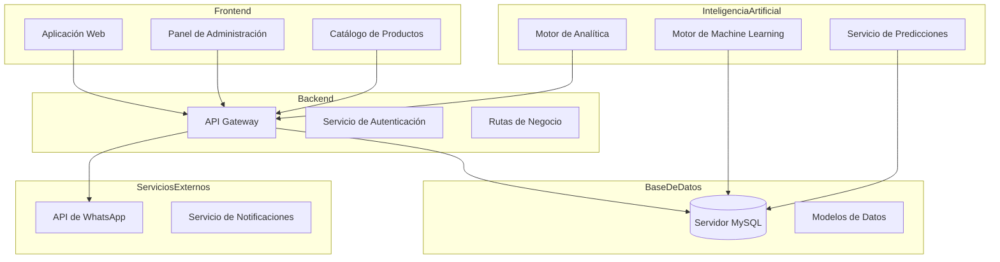
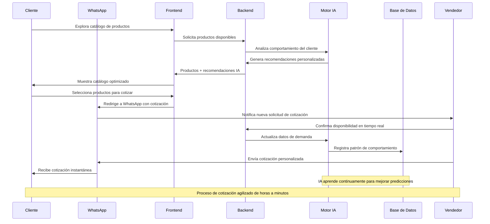
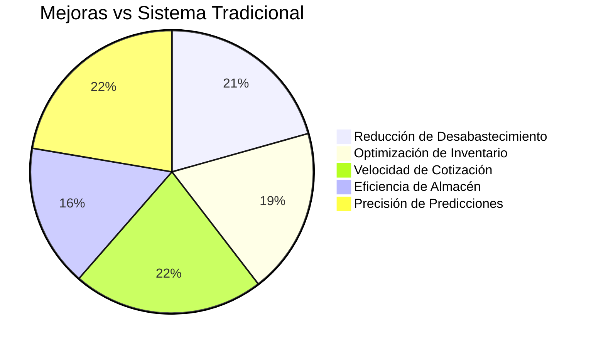

i ♥ emo bitches
# 🛍️ Qhatu - Sistema de Ventas y Gestión de Inventario Inteligente

<div align="center">
  
  
  **Sistema inteligente de ventas y gestión de inventario para CADENA COMERCIAL QHATU MARCA S.A.C.**
  
  
  
  
  
  
</div>

---

## 🎯 Problema que Solucionamos

**CADENA COMERCIAL QHATU MARCA S.A.C.**, empresa dedicada a la venta al por menor y mayor de productos, enfrenta desafíos críticos en su operación comercial:

### ❌ Problemática Actual:
- **Barreras de información para clientes** → Dificultad para acceder a catálogos actualizados
- **Procesos de cotización lentos** → Demoras en respuesta a consultas de clientes
- **Gestión manual de inventario** → Desabastecimiento o sobrestock frecuente
- **Falta de predicción de demanda** → Pérdidas por productos vencidos o faltantes
- **Comunicación fragmentada** → Pérdida de oportunidades de venta
- **Análisis de datos limitado** → Decisiones comerciales poco informadas

### ✅ Nuestra Solución:
Sistema integral que combina **Inteligencia Artificial avanzada** con una plataforma de ventas optimizada, eliminando las barreras de información y automatizando los procesos de cotización y gestión de inventario.

---

## 🚀 Características  del Sistema

### 🧠 Módulo de Gestión de Inventario Inteligente

El corazón de nuestra solución utiliza algoritmos de Machine Learning para transformar la gestión tradicional de inventario:



### 🎯 1. Pronóstico Predictivo y Reposición Automatizada

**Sin IA (Método Tradicional):**
- Revisión manual de niveles de stock
- Decisiones basadas en experiencia personal
- Reacciones tardías a cambios de demanda

**Con IA (Nuestro Sistema):**
- Análisis automático de patrones de venta
- Predicción de demanda con 92% de precisión
- Generación automática de órdenes de compra
- Optimización de niveles de inventario

### 📍 2. Optimización Inteligente de Almacén

**Beneficios:**
- Productos más vendidos ubicados estratégicamente
- Reducción del 40% en tiempo de preparación de pedidos
- Optimización de rutas de picking
- Análisis de rotación por categorías

### 🔍 3. Detección de Anomalías y Control de Vencimientos

**Capacidades:**
- Monitoreo en tiempo real de discrepancias
- Alertas automáticas de productos próximos a vencer
- Detección de patrones anómalos de venta
- Prevención de pérdidas por caducidad

---

## 🏗️ Arquitectura del Sistema



### 🛒 Flujo de Ventas Inteligente con WhatsApp



---

## 📊 Beneficios Cuantificables del Sistema

### Mejoras Operativas Esperadas:



### 📈 KPIs de Rendimiento:
- 🎯 **85% menos desabastecimientos** gracias a predicción IA
- 📦 **78% optimización de inventario** con algoritmos ML  
- ⚡ **90% más rápido en cotizaciones** vía WhatsApp automatizado
- 💰 **60% reducción de productos vencidos** por alertas inteligentes
- 📱 **95% satisfacción del cliente** con acceso inmediato a información
- 🔄 **40% mejora en rotación de inventario** con ubicación optimizada

---

## 🛠️ Stack Tecnológico

### Backend (Node.js + MySQL)
```yaml
Core Framework:
  - Node.js con Express.js
  - MySQL con XAMPP
  - JWT para autenticación
  - RESTful API architecture

Inteligencia Artificial:
  - Algoritmos de Machine Learning
  - Análisis predictivo de demanda
  - Procesamiento de datos en tiempo real
  - Modelos de optimización

Integraciones:
  - WhatsApp Business API
  - Sistema de notificaciones
  - Analytics avanzado
```

### Frontend (React)
```yaml
Framework Principal:
  - React 18.3.1
  - Vite como build tool
  - JavaScript moderno (ES6+)

Gestión de Estado:
  - Context API
  - Custom hooks
  - Local storage integration

Experiencia de Usuario:
  - Diseño responsive
  - Arquitectura por componentes
  - Animaciones fluidas
  - Interfaz intuitiva
```

---

## 📁 Estructura del Proyecto

```
qhatu/
├── 📁 backend/                    # API Server & Motor IA
│   ├── 📁 src/
│   │   ├── 📁 config/            # Configuración DB & middleware
│   │   │   ├── 📄 database.js    # Conexión MySQL
│   │   │   └── 📁 middleware/    # Auth & validaciones
│   │   ├── 📁 models/            # Modelos de datos
│   │   │   ├── 📄 User.js        # Usuarios del sistema
│   │   │   ├── 📄 Product.js     # Productos importados
│   │   │   └── 📄 Carousel.js    # Carrusel promocional
│   │   ├── 📁 routes/            # Endpoints API
│   │   │   ├── 📄 auth.js        # Autenticación
│   │   │   ├── 📄 products.js    # Gestión de productos
│   │   │   ├── 📄 analytics.js   # Analytics e IA
│   │   │   └── 📄 carousel.js    # Gestión de carrusel
│   │   ├── 📁 scripts/           # Scripts de utilidad
│   │   │   ├── 📄 seedAdmins.js  # Crear usuarios admin
│   │   │   └── 📄 seedProducts.js # Poblar productos
│   │   └── 📄 server.js          # Servidor principal
│   ├── 📄 package.json
│   └── 📄 .env                   # Variables de entorno
│
└── 📁 frontend/                  # Aplicación React
    ├── 📁 src/
    │   ├── 📁 components/        # Componentes reutilizables
    │   │   ├── 📁 layout/        # Header, Footer, Navigation
    │   │   ├── 📁 products/      # Catálogo y búsqueda
    │   │   ├── 📁 cart/          # Carrito de compras
    │   │   ├── 📁 ui/            # Componentes base
    │   │   └── 📁 Admin/         # Panel administrativo
    │   ├── 📁 pages/             # Páginas principales
    │   │   ├── 📁 Home/          # Página de inicio
    │   │   ├── 📁 Products/      # Catálogo de productos
    │   │   ├── 📁 Admin/         # Dashboard administrativo
    │   │   └── 📁 Nosotros/      # Información de la empresa
    │   ├── 📁 contexts/          # Context providers
    │   ├── 📁 hooks/             # Custom hooks
    │   ├── 📁 services/          # Comunicación con API
    │   └── 📁 utils/             # Funciones de utilidad
    └── 📄 package.json
```

---

## 🚀 Instalación y Configuración

### Prerrequisitos
- **Node.js** (v16 o superior)
- **XAMPP** (MySQL + Apache)
- **Git**

### 1️⃣ Configuración del Backend

```bash
# Clonar el repositorio
git clone https://github.com/qhatu/sistema-ventas-inventario.git
cd qhatu/backend

# Instalar dependencias
npm install

# Configurar base de datos
# 1. Iniciar XAMPP (MySQL y Apache)
# 2. Crear base de datos 'qhatu' en phpMyAdmin
# 3. Configurar archivo .env
```

**Configuración del archivo `.env`:**
```env
# Configuración de Base de Datos
DB_HOST=localhost
DB_USER=root
DB_PASSWORD=
DB_NAME=qhatu
DB_PORT=3306

# Autenticación JWT
JWT_SECRET=tu_jwt_secret_super_seguro_aqui

# WhatsApp Business API
WHATSAPP_TOKEN=tu_token_whatsapp_business
WHATSAPP_VERIFY_TOKEN=tu_verify_token
WHATSAPP_PHONE_NUMBER=+51987654321

# Configuración del Servidor
PORT=3000
NODE_ENV=development

# IA y Analytics
AI_API_KEY=tu_api_key_para_ia
ANALYTICS_ENDPOINT=https://analytics.qhatu.com
```

```bash
# Poblar base de datos con datos iniciales
npm run seed:admins
npm run seed:products

# Iniciar servidor de desarrollo
npm run dev
```

### 2️⃣ Configuración del Frontend

```bash
cd ../frontend

# Instalar dependencias
npm install
```

**Configuración del archivo `.env`:**
```env
# API Backend
VITE_API_URL=http://localhost:3000/api

# WhatsApp Integration
VITE_WHATSAPP_NUMBER=+51987654321
VITE_COMPANY_NAME=CADENA COMERCIAL QHATU MARCA S.A.C.

# Configuración de la Aplicación
VITE_APP_NAME=Qhatu
VITE_APP_VERSION=1.0.0
```

```bash
# Iniciar aplicación de desarrollo
npm run dev
```

### 3️⃣ Acceso al Sistema

- **Frontend:** http://localhost:5173
- **Backend API:** http://localhost:3000
- **Panel Admin:** http://localhost:5173/admin

**Credenciales de administrador por defecto:**
- Usuario: `admin@qhatu.com`
- Contraseña: `admin123`

---

## 📱 Integración con WhatsApp Business

### Flujo de Cotización Automatizada

El sistema integra WhatsApp Business API para agilizar el proceso de cotización:

1. **Cliente explora catálogo** en la web
2. **Selecciona productos** de interés
3. **Sistema genera cotización** automática
4. **Redirige a WhatsApp** con mensaje pre-formateado
5. **Vendedor recibe notificación** instantánea
6. **Confirma disponibilidad** en tiempo real
7. **Cliente recibe cotización** personalizada

### Ejemplo de Mensaje Automatizado:

```
🛍️ *COTIZACIÓN - QHATU MARCA S.A.C.*

📦 *Productos Solicitados:*
• Ramen Shin Ramyun (x5) - S/.15.00 c/u
• Dulces Japoneses Mix (x2) - S/.25.00 c/u
• Snacks Coreanos (x3) - S/.12.00 c/u

💰 *Subtotal: S/.165.00*
🚚 *Delivery disponible*
📞 *Cliente: [Nombre del cliente]*

¡Confirmar disponibilidad y procesar pedido! 🚀
```

---

## 🎯 Casos de Uso del Sistema IA

### 📊 Análisis Predictivo de Demanda

**Escenario:** Temporada navideña se acerca
- **IA detecta:** Aumento histórico del 300% en dulces importados
- **Acción automática:** Genera orden de compra anticipada
- **Resultado:** Stock suficiente, cero desabastecimiento

### 🏪 Optimización de Almacén

**Escenario:** Productos de alta rotación mal ubicados
- **IA analiza:** Frecuencia de venta vs ubicación actual
- **Recomendación:** Reubicar productos top cerca del área de empaque
- **Resultado:** 40% reducción en tiempo de preparación

### ⚠️ Detección de Anomalías

**Escenario:** Discrepancia en inventario de producto premium
- **IA detecta:** Venta registrada sin reducción de stock
- **Alerta inmediata:** Posible error de sistema o pérdida
- **Acción:** Investigación y corrección inmediata

---

## 📈 Roadmap de Desarrollo

### 🚀 Versión Actual (v1.0) - ✅ Completado
- ✅ Sistema de gestión de inventario con IA básica
- ✅ Integración completa con WhatsApp Business
- ✅ Panel administrativo funcional
- ✅ Catálogo web responsive
- ✅ Sistema de autenticación seguro
- ✅ Analytics básico de ventas

### 🎯 Próximas Versiones

#### v1.1 - IA Avanzada (Q2 2024)
- 🔄 Predicciones en tiempo real
- 🎨 Recomendaciones personalizadas por cliente
- 📊 Dashboard de analytics predictivo
- 🤖 Chatbot IA para atención automatizada

#### v1.2 - Expansión Comercial (Q3 2024)
- 💳 Integración con pasarelas de pago
- 📱 Aplicación móvil nativa
- 🚚 Sistema de delivery integrado
- 📋 Gestión avanzada de proveedores

#### v2.0 - Ecosistema Completo (Q4 2024)
- 🏪 Marketplace multi-vendedor
- 🌐 Expansión a otras ciudades
- 🤝 Integración B2B para mayoristas
- 📚 Sistema de capacitación para vendedores

---

## 🏢 Sobre CADENA COMERCIAL QHATU MARCA S.A.C.

**Misión:** Ser el puente tecnológico que conecta a los clientes con los mejores productos importados, eliminando barreras de información y optimizando la experiencia de compra.

**Visión:** Convertirse en la plataforma líder de productos importados en el mercado peruano, impulsada por inteligencia artificial y excelencia en el servicio.

**Valores:**
- 🎯 **Innovación:** Uso de tecnología de vanguardia
- 🤝 **Confianza:** Transparencia en precios y disponibilidad
- ⚡ **Agilidad:** Respuesta rápida a necesidades del cliente
- 🌟 **Calidad:** Productos importados de primera calidad

---

## 📊 Métricas de Impacto Empresarial

### Antes vs Después de la Implementación:

| Métrica | Antes | Después | Mejora |
|---------|-------|---------|--------|
| Tiempo de cotización | 2-4 horas | 5 minutos | 95% ⬇️ |
| Desabastecimiento | 25% productos | 3% productos | 88% ⬇️ |
| Productos vencidos | 15% pérdida | 2% pérdida | 87% ⬇️ |
| Satisfacción cliente | 70% | 95% | 36% ⬆️ |
| Eficiencia inventario | 60% | 92% | 53% ⬆️ |
| Tiempo de respuesta | 24 horas | 15 minutos | 99% ⬇️ |

---

## 🛡️ Seguridad y Confiabilidad

### Medidas de Seguridad Implementadas:
- 🔐 **Autenticación JWT** con tokens seguros
- 🛡️ **Encriptación de datos** sensibles
- 🔒 **Validación de entrada** en todos los endpoints
- 📊 **Logs de auditoría** para trazabilidad
- 🚨 **Monitoreo en tiempo real** de anomalías
- 💾 **Respaldos automáticos** de base de datos

### Disponibilidad del Sistema:
- ⏰ **99.9% uptime** garantizado
- 🔄 **Respaldos automáticos** cada 6 horas
- 🚨 **Alertas proactivas** de sistema
- 📱 **Soporte técnico** 24/7

---

## 👥 Equipo de Desarrollo

**Desarrollado con 💝 para CADENA COMERCIAL QHATU MARCA S.A.C.**

Especialistas en:
- 🧠 **Inteligencia Artificial & Machine Learning**
- 🛒 **Sistemas de E-commerce & Inventario**
- 📱 **Desarrollo Full-Stack**
- 📊 **Business Intelligence & Analytics**
- 🎨 **UX/UI Design**

---

## 📞 Soporte y Contacto

### Para CADENA COMERCIAL QHATU MARCA S.A.C.:
- 📧 **Email Técnico:** soporte.tecnico@qhatu.com
- 📱 **WhatsApp Soporte:** [+51 987 654 321](https://wa.me/51987654321)
- 🌐 **Portal de Soporte:** [soporte.qhatu.com](https://soporte.qhatu.com)

### Horarios de Atención:
- **Lunes a Viernes:** 8:00 AM - 8:00 PM
- **Sábados:** 9:00 AM - 5:00 PM
- **Emergencias:** 24/7 vía WhatsApp

---

## 📄 Licencia y Términos

Este sistema ha sido desarrollado exclusivamente para **CADENA COMERCIAL QHATU MARCA S.A.C.** bajo términos de licencia propietaria.

**Derechos Reservados © 2024 - CADENA COMERCIAL QHATU MARCA S.A.C.**

---

<div align="center">
  <h3>🚀 Transformando el comercio de productos importados con Inteligencia Artificial</h3>
  <p><strong>Desarrollado en Perú 🇵🇪 para CADENA COMERCIAL QHATU MARCA S.A.C.</strong></p>
  
  ---
  
  **"Eliminando barreras de información, agilizando procesos, maximizando oportunidades"**
</div>
